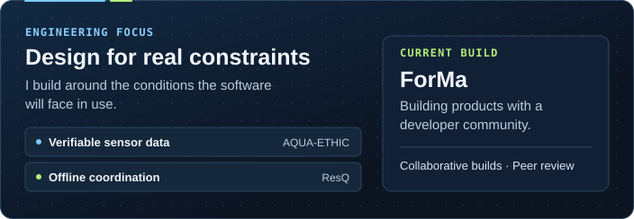

  

I’m **A Jerrin Anto**, a B.Tech CSE (AI & ML) student and founder of **ForMa**. I build AI applications and cloud-backed tools, with projects focused on data integrity, offline communication, and access control.

**[View résumé](https://drive.google.com/file/d/1p2h3YbaqEVjeBf-1VQ3y7pBRkurKsJ3d/view?usp=sharing)** · [Portfolio](https://jerrin-ai.vercel.app/) · [LinkedIn](https://www.linkedin.com/in/jerrin-anto-74a836392/)

<picture>
  <source media="(max-width: 600px)" srcset="./assets/engineering-focus-mobile.svg">
  
</picture>

## Featured projects

### [AQUA-ETHIC](https://github.com/ANTOJERRIN/AQUA-ETHIC)
Water-quality monitoring with ESP32 sensors. The API hashes readings and anchors those hashes on-chain so the recorded data can be checked for tampering.

`ESP32` · `Express` · `SQLite` · `Solidity`

### [Lifeline](https://github.com/ANTOJERRIN/LIFELINE-)
A medical-records app that extracts information from scanned reports. Patients can ask Vitalis, an AI assistant, about their history through consent-controlled access.

`Python` · `FastAPI` · `Supabase` · `OCR`

### [Cardio.AI / WithLove](https://github.com/ANTOJERRIN/Withlove101)
A cardiovascular risk assessment project that combines a prediction API with interactive 3D and AR heart visualizations.

`React` · `FastAPI` · `scikit-learn` · `Three.js`

### [ResQ](https://github.com/Jack26-bit/Resq)
A disaster-response app for SOS reporting and coordination. Nearby responders can communicate peer-to-peer when internet access is unavailable.

`Flutter` · `Firebase` · `Gemini` · `Nearby Connections`

## What I’m working on

- **[ForMa](https://forma-9c8t.onrender.com/)** · I founded ForMa as a startup and developer community where members build products together and review each other’s code.
- **Nexstep Network** · I collaborate on early product prototypes and help validate MVPs.
- **CodeWithJeru** · I share what I’m building and learning about AI and software development on Instagram and YouTube.
- **Open source and community** · GSSoC ’26 and OSCI ’26 contributor. I also help coordinate developer events with Technexus.

## Selected milestones

- Took **AQUA-ETHIC** to the DECODE SIH National Grand Finale as one of the **top 50 finalist teams**.
- Gained internship experience through **Scaler School of Technology’s YIIC**, **Hi Devs**, and **Gigni**.
- Participated in **seven hackathons** and earned **Google Cloud skill badges**.

## Languages and tools

### Languages

### AI & ML

### Web & data

### Cloud & dev tools

### Mobile & IoT

## GitHub stats

[View my GitHub profile](https://github.com/ANTOJERRIN)

## Connect

I'm open to internships and collaborations in AI/ML, full-stack development, and cloud.

[Email](mailto:jerrinanto18@gmail.com) · [LeetCode](https://leetcode.com/u/antojerrin/) · [YouTube](https://www.youtube.com/@Tech2007-g5m) · [Instagram](https://www.instagram.com/codewithjeru/)
